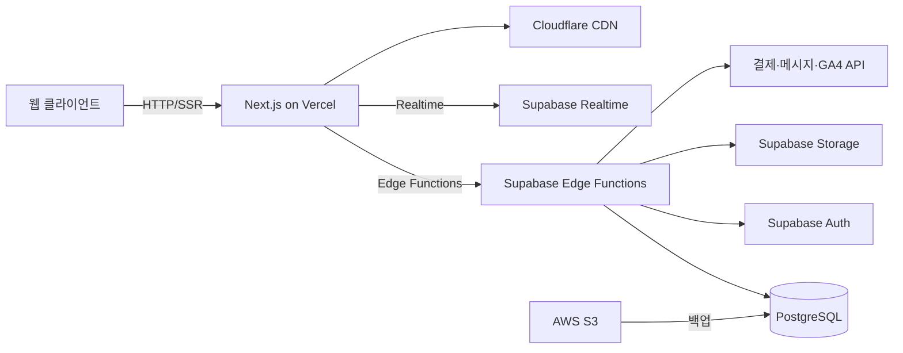

# Technical Requirements Document (TRD)

## 1. Executive Technical Summary
- **프로젝트 개요**  
  웹 기반 펜션 예약 서비스로, 고객용 웹, 모임장 전용 콘솔, 운영자 관리자 페이지로 구성됩니다. Next.js 14를 사용한 SSR/ISR과 Supabase(PostgreSQL, Auth, Storage, Edge Functions)를 결합하여 빠르고 확장 가능한 풀스택 구조를 채택합니다.  
- **핵심 기술 스택**  
  Frontend: Next.js 14, TypeScript, Tailwind CSS  
  Backend: Supabase(PostgreSQL, Auth, Storage, Realtime, Edge Functions)  
  Infra: Vercel, Cloudflare CDN, AWS S3 백업  
  Third-Party: I’mport 결제, 카카오톡 비즈메시지, Google Analytics 4  
- **주요 기술 목표**  
  · P95 응답시간 1초 이하· 동시 접속자 5,000명 지원· RLS 기반 보안· 수평 확장 구조  
- **핵심 가정 사항**  
  · Supabase Edge Functions가 모든 커스텀 비즈니스 로직을 처리· Cloudflare CDN이 정적/동적 콘텐츠 가속· I’mport·카카오 API 가용성· RLS로 멀티 테넌시 보안 확보  

## 2. Tech Stack

| Category                | Technology / Library               | Reasoning (선택 이유)                          |
| ----------------------- | --------------------------------- | ---------------------------------------------- |
| Frontend Framework      | Next.js 14 (App Router)           | SSR/ISR, Server Actions로 SEO·성능 최적화       |
| Language                | TypeScript                        | 정적 타이핑으로 안정성·생산성 확보              |
| UI Toolkit              | Tailwind CSS                      | 유연한 유틸리티 클래스 기반 스타일링            |
| Data Fetching           | Next.js Server Actions, SWR       | 서버-클라이언트 데이터 일관성·캐싱 활용         |
| Localization            | next-i18next                      | 다국어 지원(한국어·영어) 간편 설정              |
| Backend BaaS             | Supabase                          | Postgres, Auth, Storage, Realtime 통합 제공     |
| Database                | PostgreSQL                        | 관계형 DB, RLS로 멀티 테넌시 보안              |
| Auth & Security         | Supabase Auth (JWT, OAuth2), RLS  | 이메일·SNS 로그인, 세션 안전 관리               |
| Real-time               | Supabase Realtime, WebSocket      | 재고·예약 현황 실시간 업데이트                  |
| Storage                 | Supabase Storage, AWS S3 Backup   | 사용자 업로드 파일 관리, 중요 데이터 백업       |
| Serverless Functions    | Supabase Edge Functions           | 결제, 알림, 커스텀 API 로직 경량화              |
| CDN & Caching           | Vercel + Cloudflare CDN           | 글로벌 엣지 캐싱, 정적·동적 콘텐츠 가속          |
| CI/CD & Hosting         | Vercel                            | 자동 배포·롤백, Preview 배포 지원               |
| Payment Gateway         | I’mport                           | 국내 주요 결제 수단 통합                        |
| Messaging & Notifications| Kakao Biz Message, SMS API        | 예약 알림, 체크인 리마인더                      |
| Analytics & Monitoring  | Google Analytics 4, Sentry        | 사용자 행동 분석, 에러 모니터링                 |

## 3. System Architecture Design

### Top-Level Building Blocks
- **고객용 웹 애플리케이션**  
  Next.js 14 기반 SSR/ISR, Tailwind CSS UI  
- **모임장 전용 콘솔 & 운영자 관리자 페이지**  
  역할 기반 페이지 분리, RBAC 지원  
- **백엔드 API 레이어**  
  Supabase Edge Functions로 결제·알림·CRUD 처리  
- **데이터 저장소**  
  PostgreSQL(DB), Storage(이미지·파일)  
- **실시간 서비스**  
  Supabase Realtime + WebSocket으로 재고/예약 푸시  
- **서드파티 연동**  
  I’mport, Kakao Biz Message, Google Analytics  
- **인프라 & 배포**  
  Vercel + Cloudflare CDN + AWS S3 백업

### Top-Level Component Interaction Diagram

- 웹 클라이언트는 Next.js SSR/ISR을 통해 HTML/CSS/JS를 수신  
- Next.js에서 호출된 Edge Functions가 비즈니스 로직 수행 후 Postgres/API 연동  
- Realtime 구독으로 재고·예약 상태를 클라이언트에 푸시  
- CDN(Cloudflare)이 정적 자산 및 ISR 캐싱 가속  
- 외부 서비스(I’mport, Kakao Biz) 호출은 Edge Functions에서 처리, 로깅  

### Code Organization & Convention
**Domain-Driven Organization Strategy**  
- **Domain Separation**: room, program, reservation, user, payment, notification, admin  
- **Layer-Based Architecture**: presentation (pages/components), business logic (services/functions), data access (db schemas/migrations), infrastructure (config, pipeline)  
- **Feature-Based Modules**: 각 도메인별 모듈로 묶어 재사용성 및 유지보수성 확보  
- **Shared Components**: UI components, utils, types, hooks  

**Universal File & Folder Structure**
```
/
├── public
│   └── assets/...
├── src
│   ├── pages
│   │   ├── index.tsx
│   │   ├── reservation/
│   │   ├── admin/
│   │   └── auth/
│   ├── components
│   │   └── ui/...
│   ├── domains
│   │   ├── room/
│   │   ├── program/
│   │   ├── reservation/
│   │   ├── user/
│   │   └── payment/
│   ├── services
│   │   ├── supabaseClient.ts
│   │   ├── paymentService.ts
│   │   └── notificationService.ts
│   ├── utils
│   ├── hooks
│   ├── styles
│   └── lib
├── supabase
│   ├── functions/
│   └── migrations/
├── vercel.json
├── tsconfig.json
└── package.json
```

### Data Flow & Communication Patterns
- **Client-Server Communication**: Next.js Server Actions/API Routes → Supabase Edge Functions → 클라이언트  
- **Database Interaction**: supabase-js ORM-like 사용, RLS 정책, 트랜잭션 처리  
- **External Service Integration**: Edge Functions 내 재시도 로직, 백오프 전략  
- **Real-time Communication**: Supabase Realtime 채널 구독, 클라이언트 WebSocket 수신  
- **Data Synchronization**: 낙관적 잠금·트랜잭션·행 수준 잠금으로 재고·예약 일관성 확보  

## 4. Performance & Optimization Strategy
- Next.js ISR/SSG로 정적 페이지 캐싱, API 응답 최소화  
- Cloudflare CDN 및 Vercel Edge Caching으로 글로벌 엣지 캐싱  
- DB 인덱싱(date, room_id, program_id), 파티셔닝 고려  
- 이미지·정적 리소스 최적화(Next/Image, lazy loading)  
- SWR/React Query 등 클라이언트 캐싱, 배치 요청  

## 5. Implementation Roadmap & Milestones
### Phase 1: Foundation (MVP Implementation)
- **Core Infrastructure**: Vercel 프로젝트 설정, Supabase 초기 스키마·Auth  
- **Essential Features**: 객실·프로그램 통합 예약, 결제(I’mport), 로그인·회원 시스템  
- **Basic Security**: TLS 설정, JWT·RLS 적용  
- **Development Setup**: CI/CD(Vercel), 코드 린팅·타입체크  
- **Timeline**: D+0 ~ D+60 (60일)  

### Phase 2: Feature Enhancement
- **Advanced Features**: 모임장 모드(다중 객실·CSV), 마이페이지, 쿠폰 엔진  
- **Performance Optimization**: DB 튜닝, 캐싱 전략 고도화  
- **Enhanced Security**: 휴대폰 인증, OWASP 대응  
- **Monitoring Implementation**: Sentry, Supabase Analytics  
- **Timeline**: D+61 ~ D+90 (30일)  

### Phase 3: Scaling & Optimization
- **Scalability Implementation**: 멀티 테넌시, 읽기 복제본, 오토스케일  
- **Advanced Integrations**: 추가 결제사, AI 추천 PoC  
- **Enterprise Features**: B2B 패키지, 수요 예측  
- **Compliance & Auditing**: GDPR, ISO, 로그 감사  
- **Timeline**: D+91 ~ D+150 (60일)  

## 6. Risk Assessment & Mitigation Strategies
### Technical Risk Analysis
- **Technology Risks**: Supabase Edge 기능 한계 → 독립 Lambda/FaaS 연동  
- **Performance Risks**: DB 병목 → 리드 리플리카, 캐싱, 파티셔닝  
- **Security Risks**: OAuth 토큰 유출, SQL 인젝션 → RLS, Prepared Statement  
- **Integration Risks**: 서드파티 API 장애 → 재시도·폴백 로직, 다중 결제사  

### Project Delivery Risks
- **Timeline Risks**: 외부 연동 지연 → 초기 PoC, 병렬 개발  
- **Resource Risks**: Next.js 14·Supabase 경험 부족 → 내부 워크숍, 문서화  
- **Quality Risks**: 테스트 미흡 → 유닛·통합 테스트 자동화  
- **Deployment Risks**: 환경 불일치 → IaC, 스테이징 파이프라인  
- **Contingency Plans**: Vercel 롤백, DB 백업/복원 스크립트 준비  

---  
**끝.**